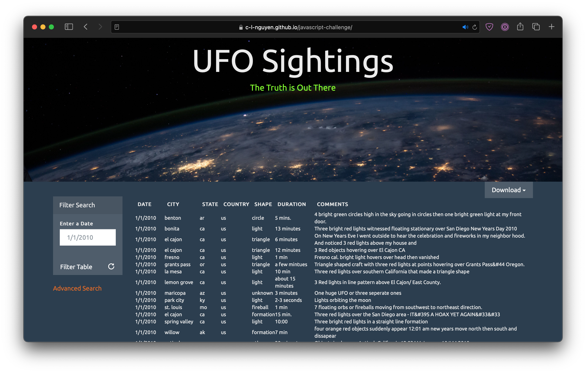
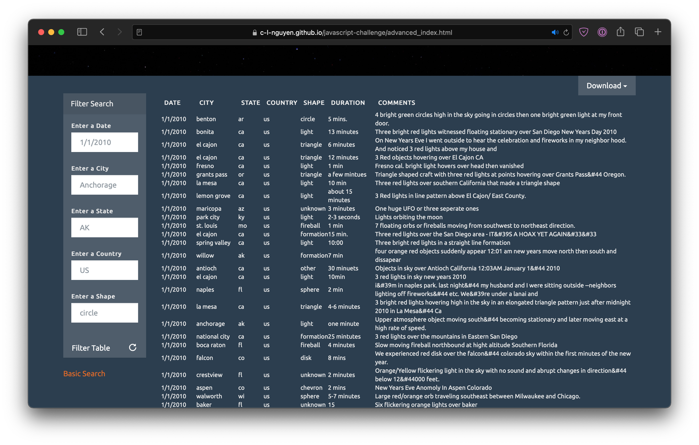

# javascript-challenge
A webpage for UFO sightings that uses JavaScript, HTML, and CSS, and D3.js. Website is at https://c-l-nguyen.github.io/javascript-challenge/

This project demonstrates the use of Javascript to create an interactive website, specifically using D3.js to collect HTML form elements in the form of DOMs (Document Object Models) and adding event triggers to elements on the page filter the given dataset based on user entry. The dataset is a sample set of UFO sightings in the U.S. (the first two weeks of January 2010 only).

These are two pages on the site: Basic and Advanced. 
* The Basic site allows the user to enter a date in the date field and filter the table according to that date and display it once the "Filter Table" button is pressed or the Enter key is pressed on the keyboard. 
* The Advanced site allows more filters for the user including Date, City, State, Country, and Shape. The user can enter one or any number of these filters to return the filtered table displayed on the page.

Additionally, extra events were added just for fun! There is a reload button which resets the table to its unfiltered state and a Download button which allows the user to download the table in either JSON or CSV format (the data is originally in JSON format but is dynamically transformed to CSV format for the download). The data filtered is what is returned for the download and is dynamically determined once the user filters it on the page.

Click around a bit to find an Easter egg too! 👽

## Previews
Basic site:

Advanced site:
